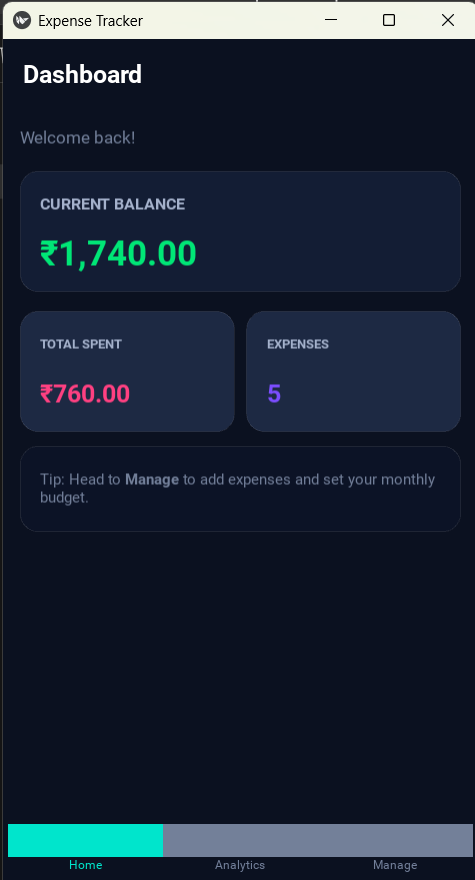
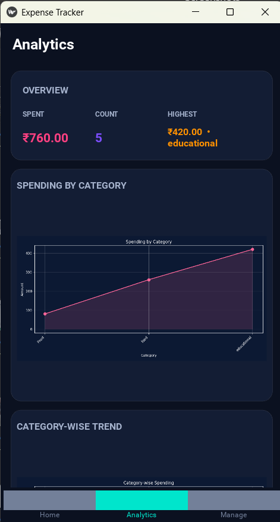
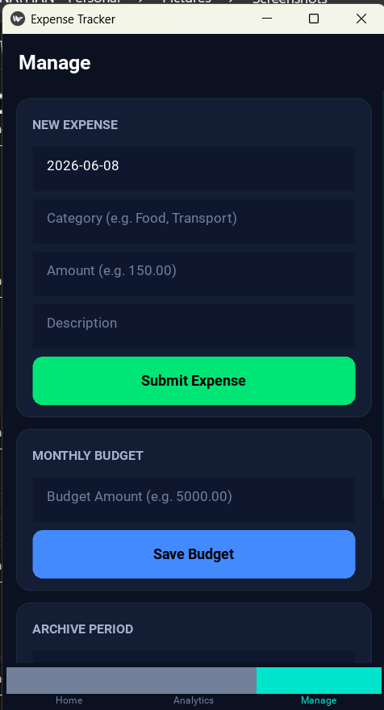

# Personal Expense Tracker
A mobile-first expense tracking app built with **Python + Kivy**, featuring real-time analytics, chart visualisations, and CSV-backed persistent storage.

---

## Download
Pre-built Windows executable available on the [Releases](https://github.com/jonathanrodrigues15287/personal-expense-tracker/releases) page — no Python installation required.

---

## Screenshots

| Dashboard | Analytics |
|-----------|-----------|
|  |  |

| Manage Expenses |
|-----------------|
|  |

---

## Features
- **Dashboard** — live balance, total spend, and expense count at a glance
- **Add & manage expenses** — date, category, amount, and description with input validation
- **Monthly budgeting** — set a budget per month and track remaining balance
- **Archive periods** — snapshot any custom date range to monthly history
- **Analytics screen** — four charts generated with Matplotlib:
  - Spending by Category (line)
  - Category-wise Trend (line)
  - Monthly Spending Trend (line)
  - Daily Expense Trend (line)
- **Dark glass-card UI** — custom Kivy design system with rounded cards, accent colours, and a bottom navigation bar
- **CSV storage** — no database required; data lives in `data/` as plain CSV files

---

## Project Structure

```text
expense_tracker/
│
├── core/                     # Business logic and database operations
│   ├── analytics.py
│   ├── budget_manager.py
│   ├── db_handler.py
│   ├── expense_manager.py
│   └── history_manager.py
│
├── data/                     # Generated graphs and database
│   └── expense_tracker.db
│
├── graphs/                   # Graph generation modules
│   ├── category_graph.py
│   ├── daily_expense_graph.py
│   └── spending_graph.py
│
├── icons/                    # Application icons
│   ├── analytics.png
│   ├── home.png
│   └── manage.png
│
├── ui/                       # User interface components
│   ├── dashboard.py
│   ├── screens.py
│   ├── theme.py
│   └── widgets.py
│
├── main.py                   # Application entry point
```

---

## Prerequisites
- Python 3.8 or higher
- pip

---

## Installation
```bash
# 1. Clone the repository
git clone https://github.com/jonathanrodrigues15287/personal-expense-tracker.git
# 2. Move into the project directory
cd personal-expense-tracker
# 3. Install dependencies
pip install -r requirements.txt
# 4. Run the app
python main.py
```

The `data/` directory and CSV files are created automatically on first launch.

---

## Building the Executable
The repo includes `ExpenseTracker.spec` for reproducible PyInstaller builds:
```bash
pip install pyinstaller
pyinstaller ExpenseTracker.spec
```
The compiled executable will be output to `dist/ExpenseTracker.exe`.

---

## Tech Stack
- Python
- Kivy
- Pandas
- Matplotlib
- CSV Storage

---

## Future Improvements
- Export reports as PDF/Excel
- AI-powered spending insights
- Recurring expense reminders

---

## License
This project is open-source and available under the MIT License.
